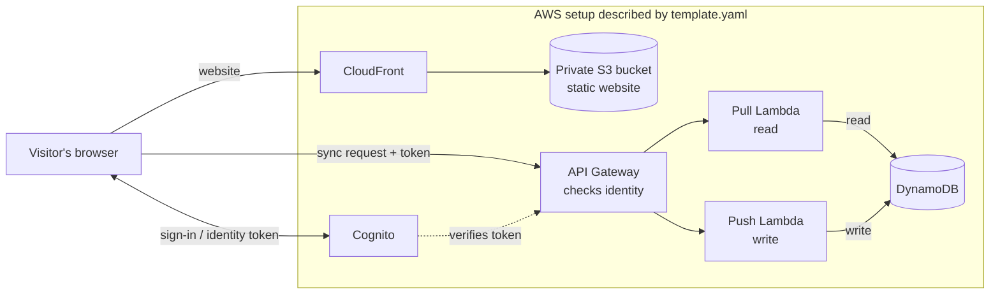

```mermaid
flowchart LR
  Browser["Visitor's browser"]

  subgraph AWS["AWS setup described by template.yaml"]
    CloudFront["CloudFront"]
    S3[("Private S3 bucket<br/>static website")]
    Cognito["Cognito"]
    API["API Gateway<br/>checks identity"]
    Pull["Pull Lambda<br/>read"]
    Push["Push Lambda<br/>write"]
    DynamoDB[("DynamoDB")]
  end

  Browser -->|website| CloudFront --> S3
  Browser <-->|sign-in / identity token| Cognito
  Browser -->|sync request + token| API
  Cognito -. verifies token .-> API
  API --> Pull -->|read| DynamoDB
  API --> Push -->|write| DynamoDB
```